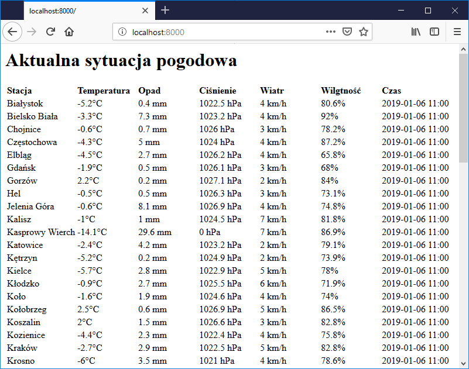

## Pogodynka
Aktualna sytuacja pogodowa na podstawie danych ze stacji meteo Instytutu Meteorologii i Gospodarki Wodnej.

## Podgląd


## Uruchamianie
```
go build && .\pogodynka.exe
```
Następnie należy otworzyć przeglądarkę internetowa pod adresem [localhost:8000](localhost:8000)

### Uwaga
Czas podawany przez aplikację jest podawany w UTC.